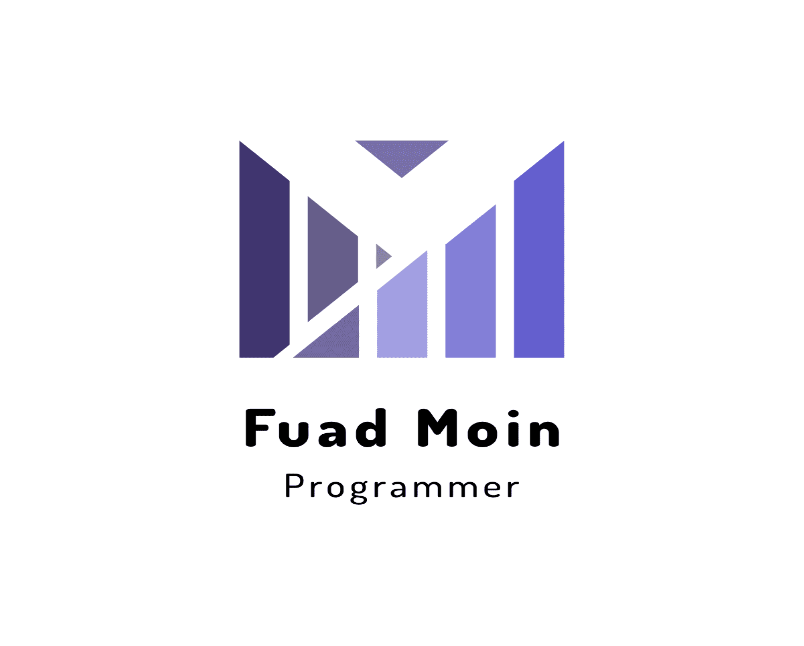

<a name="readme-top"></a>

<div align="center">
  
  
  <br/>

  <h3><b>Blog app</b></h3>

</div>

# 📗 Table of Contents

- [📖 About the Project](#about-project)
  - [🛠 Built With](#built-with)
    - [Tech Stack](#tech-stack)
    - [Key Features](#key-features)
- [💻 Getting Started](#getting-started)
  - [Prerequisites](#prerequisites)
  - [Setup](#setup)
  - [Install](#install)
  - [Usage](#usage)
  - [Run tests](#run-tests)
- [👥 Authors](#authors)
- [🔭 Future Features](#future-features)
- [🤝 Contributing](#contributing)
- [⭐️ Show your support](#support)
- [🙏 Acknowledgements](#acknowledgements)
- [📝 License](#license)

# 📖 Blog app <a name="about-project"></a>

**Blog app** is a simple project that shows the list of posts and empower readers to interact with them by adding comments and likeing posts.

## 🛠 Built With <a name="built-with"></a>

### Tech Stack <a name="tech-stack"></a>

<details>
  <summary>Client</summary>
  <ul>
    <li><a href="https://www.ruby-lang.org/en/">Ruby</a></li>
    <li><a href="https://rubyonrails.org/">Rails</a></li>
  </ul>
</details>

<details>
<summary>Database</summary>
  <ul>
    <li><a href="https://www.postgresql.org/">PostgreSQL</a></li>
  </ul>
</details>

### Key Features <a name="key-features"></a>

- **rails with postgresql database**
- **migrations to create the tables in the database**
- **migrations to add foreign key and to create indexes to the tables**
- **model class for all the tables in the database**
- **model validations**
- **unit specs for all the models**
- **controllers for users and posts models**

<p align="right">(<a href="#readme-top">back to top</a>)</p>

## 💻 Getting Started <a name="getting-started"></a>

To get a local copy up and running, follow these steps.

### Prerequisites <a name="prerequisites"></a>

In order to run this project you need:

```sh
A Computer
Code editor (VSCode,Atom etc...)
A browser (Chrome,Mozilla,Safari etc...)
Version Control System (Git and Github)
NodeJS (https://nodejs.org/en/)
PostgreSQL (https://www.postgresql.org/)
Ruby (https://www.ruby-lang.org/en/)
```

### Setup <a name="setup"></a>

Clone this repository to your desired folder:

```sh
  cd my-folder
  git https://github.com/fuadmoin/Blog-app.git
```

### Install <a name="install"></a>

Install this project with:

```sh
bundle install
```

### Usage <a name="usage"></a>

```
  code .
  rails db:setup
  rails s
```

### Run tests <a name="run-tests"></a>

To test, run the following command:

```sh
gem i rspec
rspec spec
```

## 👥 Author <a name="authors"></a>

👤 **Fuad Abdlemoin**

- GitHub: [@fuadmoin](https://github.com/fuadmoin)
- Twitter: [@Fuad01804580](https://twitter.com/Fuad01804580)
- LinkedIn: [Fuad Moin](https://www.linkedin.com/in/fuadmoin/)

<p align="right">(<a href="#readme-top">back to top</a>)</p>

## 🔭 Future Features <a name="future-features"></a>

- [ ] **[specs for all methods will be added]**
- [ ] **[Authorization will be implemented]**
- [ ] **[API end points will be added.]**

<p align="right">(<a href="#readme-top">back to top</a>)</p>

## 🤝 Contributing <a  name="contributing"></a>

Contributions, [issues](https://github.com/fuadmoin/Blog-app/issues), and feature requests are welcome!

<p align="right">(<a href="#readme-top">back to top</a>)</p>

## ⭐️ Show your support <a name="support"></a>

If you like this project please consider starring it.

<p align="right">(<a href="#readme-top">back to top</a>)</p>

## 🙏 Acknowledgments <a name="acknowledgements"></a>

I would like to thank Microverse for giving me this opportunity to work on this project. I would also like to thank my coding partner [Yosef Geda](https://github.com/Yosefgeda) for working on this project with me.

<p align="right">(<a href="#readme-top">back to top</a>)</p>

## 📝 License <a name="license"></a>

This project is [MIT](./MIT.md) licensed.

<p align="right">(<a href="#readme-top">back to top</a>)</p>
